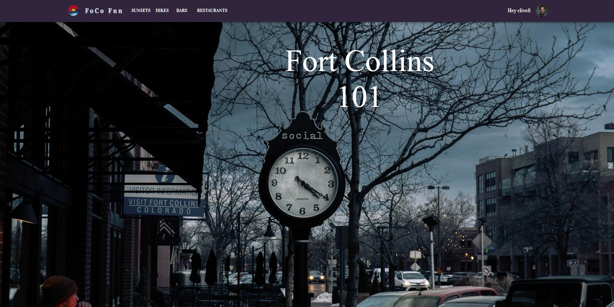
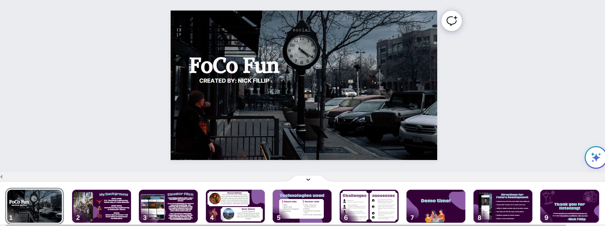

# fort-collins-top-todos 
FoCo Fun is unleashing the future of local social networking. This aesthetic app is designed to help Fort Collins residents share their favorite spots around town and make friends while doing so!  

We foster a welcoming community for users  to view top spots, add new locations, blog, share photography, connect with the community and live chat!

---
## Description
FoCo Fun was meticulously crafted to assist users in finding new entertainment spots around Fort Collins. Users can view locations, post new locations, vote on their favorites, save locations for later, blog about their trip, post photography to current locations,  make friends, and live chat.

---
## Installation

N/A

---
## Usage

When the user first loads FoCo Fun, they can navigate to various pages to see locations other users have posted to different categories. These locations will be ordered based on highest votes of the community. The user can also sign up or log in to be granted access to bonus features. Once logged in, the user can vote on favorite locations per category, save locations, post to location-blogs, add new locations, add photography to existing locations, become friends with other users, and live chat with friends.

---
## Website

Github Repo: [https://github.com/nfillip/fort-collins-top-todos](https://github.com/nfillip/fort-collins-top-todos) 
Website Link: [https://foco-fun-ea270e6a24d7.herokuapp.com/](https://foco-fun-ea270e6a24d7.herokuapp.com/)

---
## Presentation

Presentation Link: [Canva Presentation](https://www.canva.com/design/DAF2ColiAiE/xABXkOnLFAHe6-Uih5GpkA/view?utm_content=DAF2ColiAiE&utm_campaign=designshare&utm_medium=link&utm_source=editor)

---
## Credits

#### Nick Fillip:  
Github: [https://github.com/nfillip](https://github.com/nfillip) 
LinkedIn: [https://www.linkedin.com/in/nicholas-fillip/](https://www.linkedin.com/in/nicholas-fillip/) 
Resume: [https://docs.google.com/document/d/1rE64RknFGj4CufIDCUFSaU_fK_mV6zbNbC2lEyJmH30/edit?usp=sharing](https://docs.google.com/document/d/1rE64RknFGj4CufIDCUFSaU_fK_mV6zbNbC2lEyJmH30/edit?usp=sharing) 

---
## Questions

**Contact Me:**
Email: [nick.m.fillip@gmail.com](nick.m.fillip@gmail.com)
Cell: (281) 216 - 2183

---
## License

This project is under the MIT License. Please refer to the "License" file in the repo for additional information. 
© 2023 nfillip LLC. All Rights Reserved.